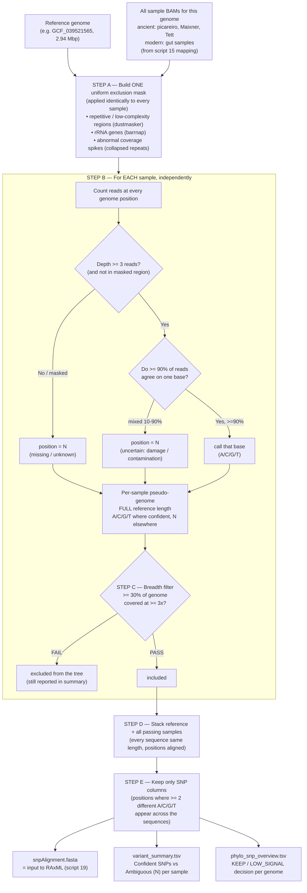

# What `18_variant_calling.sh` Does — Overview

**Script:** `18_variant_calling.sh`
**Pipeline stage:** SPAAM Ch.14 "Genotyping" → produces the SNP alignment used to build the phylogenetic tree (script 19)
**One sentence:** For one reference genome, it takes every sample's mapped reads, decides the most reliable base at every genome position for each sample, and assembles those per-sample sequences into a single SNP alignment for phylogenetics.

---

## 1. Visual scheme of the steps



---

## 2. Step-by-step in plain language

| Step | What happens | Why it matters |
|------|--------------|----------------|
| **A. Uniform mask** | Mark unreliable genome regions (repeats, rRNA, coverage spikes) **once**, then blank them in **every** sample. | Guarantees all samples are judged on the same fair set of positions; stops repeats from creating false SNPs. |
| **B. Per-sample base calling** | For each sample, at each position: require ≥3 reads and ≥90% agreement to call a base; otherwise write **N**. | This is the core variant call. The 90% rule and N-masking protect against ancient-DNA damage and contamination. |
| **C. Breadth filter** | A sample is kept only if **≥30%** of the genome is covered ≥3×. | Samples with too little data are excluded so they can't add noise. |
| **D. Stacking** | The reference and all passing samples are lined up — because all are reference length, positions already correspond. | This is the "alignment" — no gap-insertion software needed (mapping already aligned everything to the reference). |
| **E. SNP extraction** | Keep only the columns where samples actually differ (≥2 distinct bases). | These variable positions carry the phylogenetic signal; invariant positions are dropped to make the tree computation efficient. |

**Key output:** `snpAlignment.fasta` — one row per sample (+ reference), one column per SNP, with `N` wherever a sample lacked reliable data.

---

## 3. The coverage / low-breadth concern — answered point by point

> *Context: picareiro covers only ~30% of this genome. Does that distort the SNP calls and the tree?*

### Q1. "Is it an alignment of SNPs where regions may not be shared between samples?"
**Yes — and that is expected and handled correctly.** Each sample's sequence spans the **entire** reference length. Where a sample has no reads, that position is **`N` (missing data)**, *not* the reference base. So the alignment honestly records "this sample has no information here" rather than pretending it matches.

### Q2. "Is the 30% covered *consistently* (same region every time)?"
**Largely yes, and not by chance.** The covered ~30% is driven by which parts of this organism's genome are (a) conserved enough for reads to map and (b) not in the uniform mask. Because the **same exclusion mask** and the **same mapping criteria** apply to every sample, the regions that survive tend to be the **same well-behaved regions** across samples — not a random different 30% per sample. You can verify this directly (see §4).

### Q3. "Do the other samples also cover that region?"
**For the SNP columns that matter, at least partly — by construction.** A column only becomes a SNP if **≥2 samples** have a confident, *differing* A/C/G/T there. A position where only one sample has data and everyone else is `N` cannot be "variable across samples," so it is **either dropped or contributes only to that one sample's branch length**. The phylogenetically informative columns are therefore the ones with overlapping coverage between samples.

### Q4. "Is the tree built only on the covered region, or on the entire genome? (could it push samples artificially apart?)"
**Only on the positions with actual data — the model explicitly ignores `N`.** Two important safeguards:

1. **`N` = missing, not mismatch.** RAxML treats `N` as "no information." A sample is **never** penalised (pushed away on the tree) for positions it didn't cover. Distances are computed **only** over positions where both sequences being compared have real bases.
2. **Ascertainment-bias correction (`ASC_LEWIS`) in script 19.** Because we feed only SNP columns (not the whole genome), branch lengths would otherwise be inflated. The Lewis correction mathematically compensates for the dropped invariant positions, so branch lengths stay biologically meaningful.

**Net effect:** low breadth reduces the **amount** of evidence (wider confidence, i.e. it could lower bootstrap support), but it does **not** systematically push the picareiro samples artificially far from or close to others. The danger from low breadth is *under-powered* support, **not** *biased* topology.

### Q5. "What is the residual risk, then?"
The honest caveats:
- **Private SNPs** (a position covered by only one sample) add to that sample's **branch length** but not to topology. With 30% breadth these are a minority but non-zero.
- **Shared SNPs** (≥2 samples covered) are what actually resolve the tree. The more breadth overlap between samples, the higher the support.
- So the right question is **"how many SNP columns are shared vs. private?"** — quantified next.

---

## 4. How to quantify the overlap (run on the cluster)

This prints, for the 93,493 SNP columns, how many taxa have real data per column — i.e. how much of the signal is genuinely shared:

```bash
python3 - <<'EOF'
from collections import Counter
fa = "18_variant_calling_0.3/GCF_039521565/GCF_039521565.snpAlignment.fasta"
aln, name = {}, None
for line in open(fa):
    line = line.rstrip()
    if line.startswith(">"): name = line[1:]; aln[name] = []
    else: aln[name].extend(line)
taxa = list(aln); n = len(aln[taxa[0]])
comp = Counter(sum(aln[t][i].upper() not in ("N","-") for t in taxa) for i in range(n))
print(f"{n} SNP columns across {len(taxa)} taxa\n")
print(f"{'taxa with data':>15} {'columns':>10} {'%':>6}")
for k in sorted(comp, reverse=True):
    print(f"{k:>15} {comp[k]:>10} {100*comp[k]/n:>5.1f}%")
EOF
```

**Reading the result:**
- Many columns with data in **most/all taxa** → tree is well supported despite 30% breadth.
- Many columns with data in only **1–2 taxa** → topology still valid, but branch lengths/support are weaker; report bootstrap values and interpret cautiously.

---

## 5. Bottom line

The script produces a **reference-anchored SNP alignment**: every sample is genotyped across the whole genome, uncovered or unreliable positions become `N` (missing), and only positions that vary between samples are kept for tree-building. Low breadth (picareiro ~30%) means **less data**, not **biased data** — the phylogenetic model ignores missing positions entirely and only compares samples where they both have real bases, with an ascertainment-bias correction keeping branch lengths honest. The covered region is consistent across samples because identical masking and mapping rules are applied to all, and the informative SNP columns are by definition the ones with overlapping coverage. The remaining limitation is statistical power (reflected in bootstrap support), which §4 lets you measure directly.
